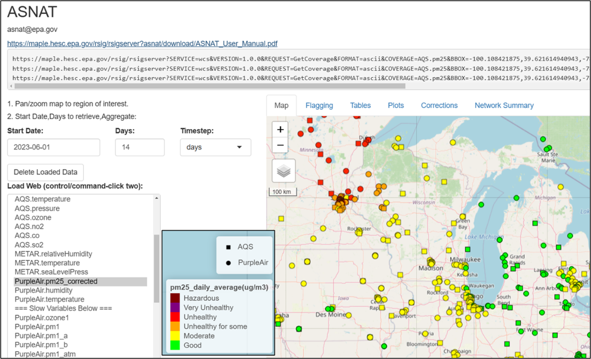
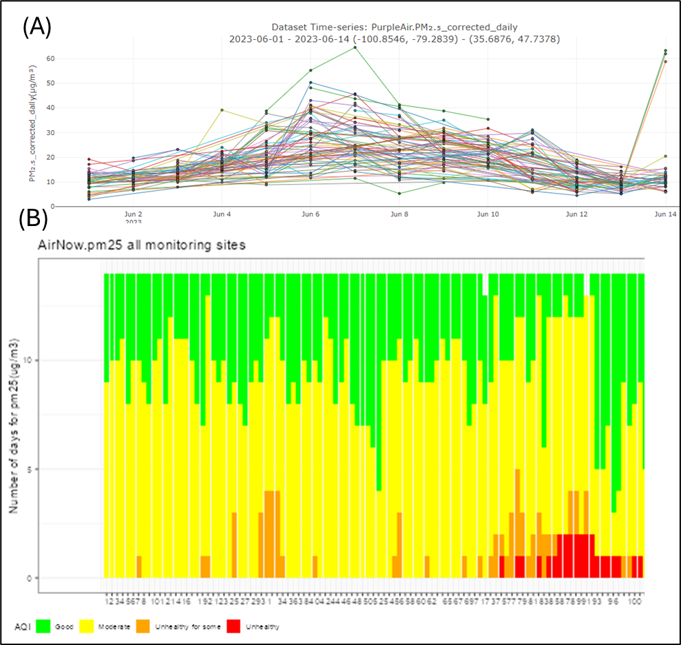
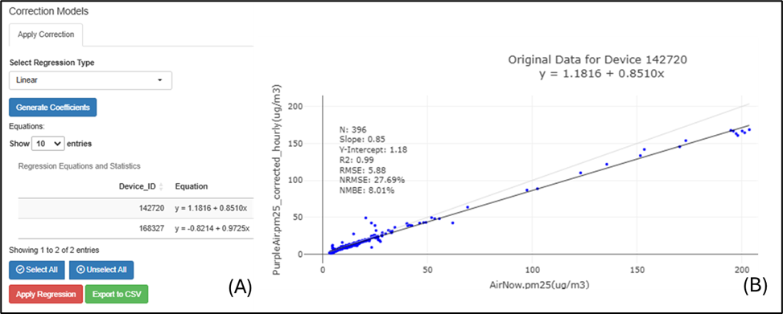
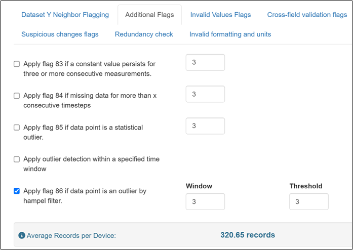

## Summary

An R-Shiny application has been developed to assist air quality professionals in 1) comparing air sensor performance to nearby ambient air reference monitors, 2) applying basic quality assurance (QA) and quality control (QC), and 3) understanding local air quality conditions.

## Statement of need

Poor air quality is associated with negative health effects [@RN1]. Air quality data are needed to understand local conditions and reduce exposure to air pollution. In the U.S., air quality is measured by air monitors operated by air agencies [@RN2]. Recent efforts supplement the national monitoring network with localized air sensor data to investigate variations at neighborhood scales. Air sensors typically cost less than conventional air monitors, but data may be noisy [@RN3; @RN4], biased, or inaccurate [@RN5]. Sensor performance may vary over time [@RN6], concentration range, or environmental conditions (e.g., high RH) [@RN7; @RN8]. Sensors are often compared with nearby measurements and corrected to improve data quality [@RN9; @RN10; @RN11; @RN12]. The air sensor data analysis required to account for these limitations is challenging for users without coding experience.

Many existing air data analysis software tools require coding experience [@RN13; @RN14]; are specific to one manufacturer’s sensor [@RN14; @RN15]; or are designed to focus on a single collocation site [@RN16]. An analysis tool is needed to more easily support this work.

## Overview

The Air Sensor Network Analysis Tool (ASNAT) is an R-Shiny [@RN17; @RN18] application that integrates data from multiple air quality networks. Air quality professionals who have base knowledge of air quality analysis are the target users of ASNAT.

Users can select data from EPA’s Remote Sensing Information Gateway (RSIG) including AirNow, EPA’s Air Quality System (AQS), Meteorological Aerodrome Report (METAR), and PurpleAir [@RN19] (<https://www.epa.gov/hesc/web-access-rsig-data>, last accessed 2/28/25) (Figure 1). AirNow and AQS data includes particulate matter, relative humidity (RH), temperature, pressure, ozone (O~3~), nitrogen dioxide (NO~2~), carbon monoxide (CO), and sulfur dioxide (SO~2~). The PurpleAir dataset includes corrected PurpleAir PM~2.5~ data (PurpleAir.pm25_corrected) corrected in the same way as on the Fire and Smoke Map (fire.airnow.gov, accessed: 1/28/25) [@RN20]. Users can also load data from standard format text files generated using the Air Sensor Data Unifier tool (<https://www.epa.gov/air-sensor-toolbox/air-sensor-data-tools>, last accessed 2/28/25).

The plots and network summary tabs include a variety of visualizations to understand network performance and local air quality (Figure 2).

Users can compare two datasets by finding nearest neighbors within a specified distance. Typically, this involves comparing a sensor dataset with more uncertainty to reference monitoring data (e.g., AirNow, AQS) to better understand sensor performance (Figure 3). ASNAT provides similar performance metrics as outlined in EPA’s performance targets [@RN21; @RN22; @RN23; @RN24].

This tool provides options to flag and/or remove anomalous data (Figure 4).

## Limitations

• Dataset size limits are dependent on local computing resources.

• Users need some air quality knowledge to use this tool and make informed decisions on ASNAT outputs (e.g., nearest neighbor radius is dependent on pollutant chemistry, outliers may be due to sensor malfunctions or pollutant events).

## Acknowledgements

This work was supported by EPA internal funding. Thank you to PurpleAir for providing data (MTA #1261-19) and Adrian Dybwad and Amanda Hawkins. Thank you to those who provided input, example datasets, and testing including: US EPA Amara Holder, Megan MacDonald, Ryan Brown, Daniel Garver, Chelsey Laurencin, Rachel Kirpes, Dena Vallano, Laura Barry, Nicole Briggs, Elizabeth Good, and Arjun Thapa (former); South Coast Air Quality Management District Wilton Mui, Vasileios Papapostolou, Randy Lam, Namrata Shanmukh Panji, Ashley Collier-Oxandale (former); Washington Department of Ecology Nate May; Puget Sound Clean Air Agency Graeme Carvlin; New Jersey Department of Environmental Protection: Luis Lim; and Desert Research Institute: Jonathan Callahan. Thank you to Heidi Paulsen (EPA), Sedona Ryan (UNC), Stephen Beaulieu (ARA), and Eliodora Chamberlain (EPA).

## Disclaimer

The views expressed in this paper are those of the author(s) and do not necessarily represent the views or policies of the US EPA. Any mention of trade names, products, or services does not imply an endorsement by the US Government or the US EPA. The EPA does not endorse any commercial products, services, or enterprises.
